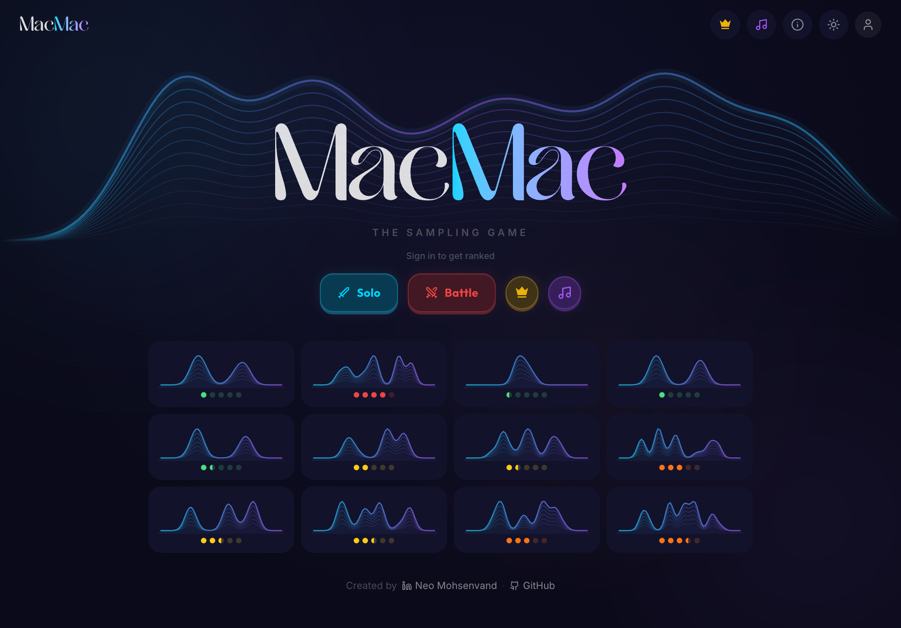

# macmac

A game that builds intuition for [Markov Chain Monte Carlo](https://en.wikipedia.org/wiki/Markov_chain_Monte_Carlo) — one of the most important ideas in computational statistics and machine learning.



## How it works

See a target probability density. Click to place samples. A [kernel density estimate](https://en.wikipedia.org/wiki/Kernel_density_estimation) builds in real time to show how well your samples match the target shape.

Your score balances two objectives:

- **Shape match** — measured by mean squared error (MSE) between the peak-normalized target PDF and your KDE. Both curves are scaled so their maximum equals 1, then compared point-by-point. Up to 8,000 points.
- **Time bonus** — up to 2,000 extra points for speed, decaying linearly to zero over 60 seconds.

There is no explicit click penalty; time naturally penalizes extra clicks. The best players find the sweet spot: enough samples to capture the distribution's shape, placed strategically where the density matters most — without wasting time.

## Game modes

### Solo

Procedurally generated levels across a difficulty grid from 1.0 to 7.5. Each level is seeded, so the same difficulty always produces the same target distribution. Complete levels to climb the solo leaderboard.

### Battle

Real-time 1v1 multiplayer. Get matched with an opponent, race to sample the same target distribution in 20 seconds. See your opponent's KDE curve update live. Win by getting a higher score. An ELO rating system (K=32, starting at 1200) tracks battle rankings. Hit 98%+ match accuracy for an instant jackpot win.

## Tech stack

- [Svelte 5](https://svelte.dev/) + [SvelteKit](https://kit.svelte.dev/) + TypeScript
- [Tailwind CSS v4](https://tailwindcss.com/)
- [Drizzle ORM](https://orm.drizzle.team/) + [Turso](https://turso.tech/) (libSQL)
- [Better Auth](https://www.better-auth.com/) for GitHub & Google sign-in
- [PartyKit](https://partykit.io/) for real-time multiplayer (WebSocket matchmaking + battle rooms)
- [KaTeX](https://katex.org/) for math rendering on the About page
- Canvas API for game visualization
- Deployed on [Vercel](https://vercel.com/)

## Local development

```bash
git clone https://github.com/NeoVand/MacMac.git
cd MacMac
npm install
```

Copy `.env.example` to `.env` and fill in your values:

```bash
cp .env.example .env
```

For local development with a file-based SQLite database, set:

```
DATABASE_URL=file:local.db
```

For sign-in to work, add your OAuth credentials (GitHub and/or Google). See `.env.example` for all options.

Push the database schema and start the dev server:

```bash
npm run db:push
npm run dev
```

### PartyKit (multiplayer)

Battle mode requires a PartyKit server. To run locally:

```bash
cd party
npm install
npx partykit dev
```

Set `VITE_PARTYKIT_HOST=localhost:1999` in your `.env` for local development.

To deploy:

```bash
cd party
npx partykit deploy
```

## Deployment

The app is configured for Vercel with a Turso database:

1. Create a free [Turso](https://turso.tech/) database
2. Push to GitHub
3. Import the repo in [Vercel](https://vercel.com/)
4. Set environment variables:
   - **Required:** `DATABASE_URL`, `DATABASE_AUTH_TOKEN`, `ORIGIN`, `BETTER_AUTH_SECRET`
   - **For sign-in:** `GITHUB_CLIENT_ID`, `GITHUB_CLIENT_SECRET`, `GOOGLE_CLIENT_ID`, `GOOGLE_CLIENT_SECRET`
   - **For battles:** `VITE_PARTYKIT_HOST` (your deployed PartyKit host)
5. Deploy

## Created by

[Neo Mohsenvand](https://github.com/NeoVand)
